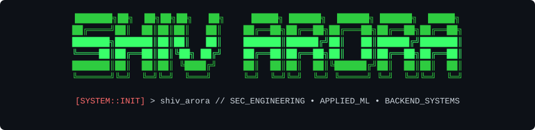
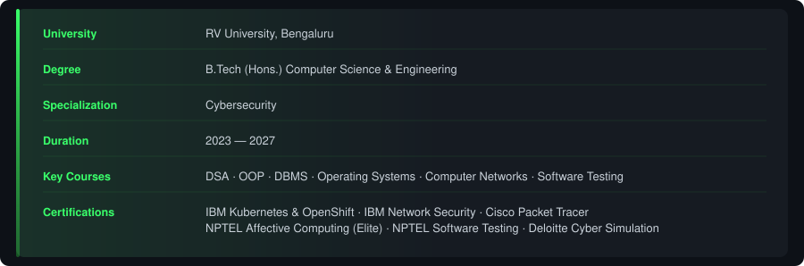
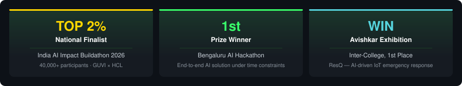

<!-- ===== CYBER-TERMINAL 3D HEADER ===== -->

---

### 🚀 Currently seeking Cybersecurity / AI-ML / Backend internship & full-time opportunities

| 🏛️ Degree | 🌏 Location | 📜 Certified | 🎯 Focus |
| --- | --- | --- | --- |
| B.Tech (Hons.) CSE — Cybersecurity, RV University (2023–2027) | Bengaluru, India | IBM Kubernetes & OpenShift · IBM Network Security · NPTEL Affective Computing (Elite) | AppSec · Applied ML · Backend Systems |

---

### 🔭 About Me

**Breaking things to learn how they work. Building things so they don't break.**

CS undergrad at RV University, Bengaluru, specialising in cybersecurity. Most of what I build lives where security meets machine learning — intrusion detection that scores traffic as it arrives, models that flag deepfake voices in nine Indian languages, agents that don't hallucinate their way through a payment flow.

Right now I'm running routing-protocol experiments on a national research testbed for RIT. Before that: hybrid DDoS detection, speech emotion models, and a top-2% finish at the India AI Impact Buildathon out of 40,000 entries.

Mostly I like problems where getting it wrong is expensive.

* 🔐 **Security** — Intrusion Detection · Traffic Analysis · Wireshark · Burp Suite · Metasploit
* 🧠 **ML** — PyTorch · Hugging Face · CNN-LSTM · wav2vec2 · Anomaly Detection
* ⚙️ **Backend** — Python · FastAPI · Flask · REST · Docker · Kubernetes
* 🌐 **Networking** — OSPF · TCP/IP · Routing · SSH

---

### 🛰️ What I'm Working On

> 🔬 **EIBP routing research @ RIT** — OSPF baselines on the FABRIC testbed, automated end-to-end so the runs actually reproduce.

> 🎙️ **VaaniRekha** — voice-fraud detection across 9+ Indian languages. Fine-tuned wav2vec2, under 6s round trip.

> 🤖 **LLM workflow agents** — schema-validated execution with real fallback handling, because "usually correct" isn't a spec.

---

### 🛠️ Tech & Security Arsenal

<table>
<tr>
<td width="150" align="right" valign="middle"><b>Languages</b></td>
<td valign="middle"> Python · C++ · Java · JavaScript · TypeScript · Bash · SQL</td>
</tr>
<tr>
<td width="150" align="right" valign="middle"><b>Backend &amp; APIs</b></td>
<td valign="middle"> FastAPI · Flask · Node.js · MySQL · Postman · REST APIs</td>
</tr>
<tr>
<td width="150" align="right" valign="middle"><b>AI / ML</b></td>
<td valign="middle"> PyTorch · TensorFlow · scikit-learn · Hugging Face · CNN-LSTM · wav2vec2</td>
</tr>
<tr>
<td width="150" align="right" valign="middle"><b>Cloud &amp; DevOps</b></td>
<td valign="middle"> Docker · Kubernetes · AWS · Nginx · Linux · Git · CI/CD</td>
</tr>
<tr>
<td width="150" align="right" valign="middle"><b>Security</b></td>
<td valign="middle"> Kali Linux · Wireshark · Nmap · Metasploit · Burp Suite</td>
</tr>
</table>

### 💼 Experience

  

---

### 🗂️ Featured Projects

<table>
<tr>
<td width="50%" valign="top">

#### 🚗 Sync Navigator
**In-Vehicle Companion on SmartDeviceLink**

> Android app projecting onto automotive head units

- 🔌 **SmartDeviceLink** integration over USB / Bluetooth transport
- 🎬 `DisplaySequencer` paces the HMI boot and screen-state flow
- 🧭 Head-unit-safe UI built for driver-distraction constraints
- 🧪 Validated against the generic HMI / Manticore simulator
- 🛠️ `Kotlin` `Android` `SDL` `SdlService`

</td>
<td width="50%" valign="top">

#### 🎙️ VaaniRekha · `Feb 2026`
**AI Voice Fraud Detection API**

> Catches deepfake voices and fraud keywords across Indian languages

- 🗣️ Fraud detection in **9+ Indian languages**
- 🧠 Fine-tuned **wav2vec2-large-xlsr** classifier
- ⚡ **Sub-6s** end-to-end latency, 3-stage inference pipeline
- 📈 Tiered risk scoring with **Sarvam AI** STT/translation
- 🛠️ `Python` `FastAPI` `wav2vec2` `Docker` `Railway`

🏅 *GUVI × HCL Hackathon*

</td>
</tr>
<tr>
<td width="50%" valign="top">

#### 🤖 UPI Autopay Agent · `Jan 2026`
**Hallucination-Resistant LLM Workflows**

> Workflow-driven agent for UPI autopay resolution

- 🧩 Intent classification + entity extraction
- ✅ **JSON schema validation** on every execution step
- 🔀 Branching logic, policy enforcement, fallback handling
- 📐 Deterministic multi-step agentic workflows
- 🛠️ `Python` `LLM Orchestration` `JSON Schema`

</td>
<td width="50%" valign="top">

#### 🛡️ Hybrid DDoS Detection · `Jun 2025`
**Layered ML Threat Scoring**

> Two-model intrusion detection over real network flow telemetry

- 🌲 **Random Forest + Isolation Forest** for layered scoring
- 📊 **150K+** flow records, 10+ engineered CICIDS2017 features
- 🎯 **90%** detection accuracy
- 📡 Attack traffic simulated with **Scapy** (1K–10K packets)
- 🛠️ `Python` `Flask` `scikit-learn` `Scapy`

🏅 *RV University security internship*

</td>
</tr>
</table>

---

### 🎓 Education

  

---

### 🏆 Recognitions & Milestones

  

### 📊 Real-Time Profile Telemetry

---

### 📡 Connect

⚡ Terminal boots fast. Systems run faster.

