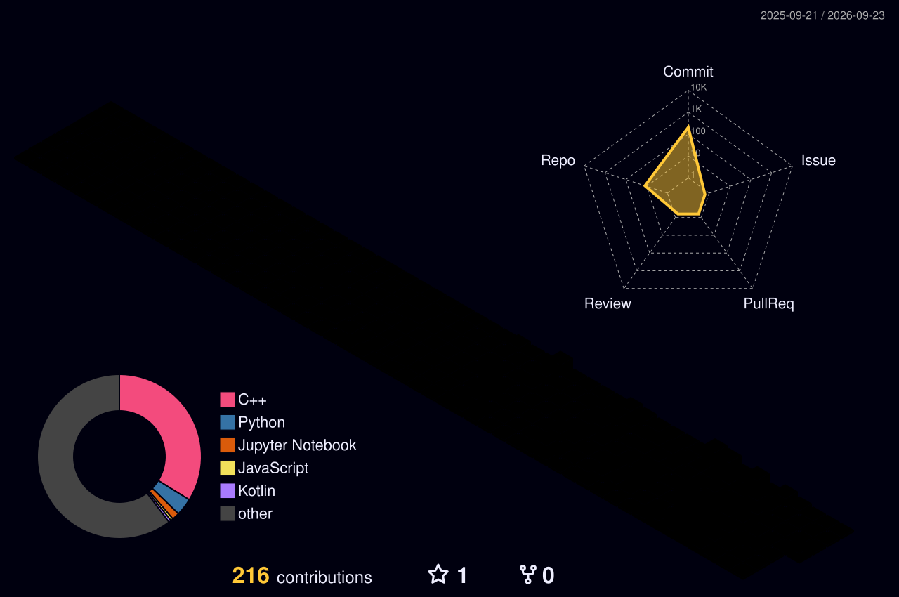

<!-- ===== HERO BANNER ===== -->

  

<!-- ===== SOCIAL & QUICK LINKS ===== -->

  
  
  
  

<!-- ===== LIVE TERMINAL INTERFACE ===== -->

  

---

### 🌐 System Architecture & Engineering

I design high-throughput backend infrastructure, intrusion detection engines, and applied machine learning pipelines designed for resilient runtime execution.

* 🛡️ **Network Security & Defense:** Deep packet inspection, traffic anomaly scoring, and automated mitigation routines.
* ⚙️ **High-Performance Backends:** Event-driven architecture, distributed caching layers, and high-concurrency APIs.
* 🤖 **Applied ML Pipelines:** Sequence anomaly detection (CNN-LSTM), low-latency model inference, and structured LLM tool orchestration.

---

### 🕹️ 3D Contribution Landscape

  

---

### 🛠️ Core Technology Stack

  <!-- Languages -->
  
  
  
  

  <!-- Frameworks & Security -->
  
  
  
  
  

---

### 🔬 Active Research & Engineering Focus

| Domain | Systems & Implementation | Key Target Outcomes |
| :--- | :--- | :--- |
| **Intrusion Defense** | Real-time traffic anomaly and DDoS filtering engines | Low-latency state inspection & automated packet drop rules |
| **Sequential Intelligence** | Deep learning pipelines for sequential log telemetry | CNN-LSTM architectures for early deviation warnings |
| **Agentic Infrastructure**| MCP integration & deterministic LLM execution | Structured context injection and safe tool calling |
| **Distributed Services** | Scalable REST & asynchronous processing layers | Concurrent task queues, caching layers, and high uptime |

---

### 🏆 Recognitions & Milestones

* 🥇 **1st Prize** — Bengaluru AI Hackathon
* 🥈 **2nd Prize** — Product Design Hackathon
* 🏅 **Winner** — Avishkar Inter-College Technical Exhibition

---

### 📊 Real-Time Profile Telemetry

  
  
  

